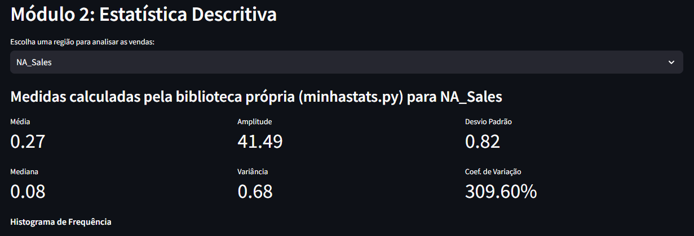
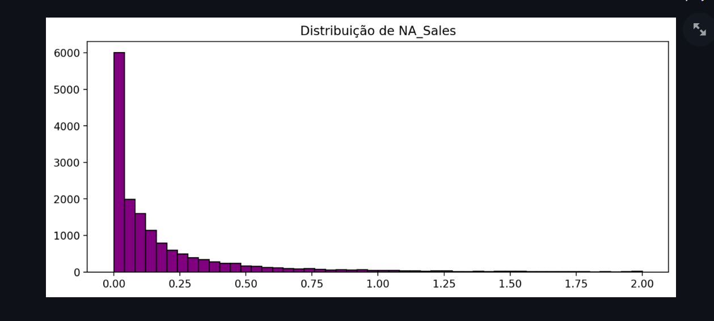
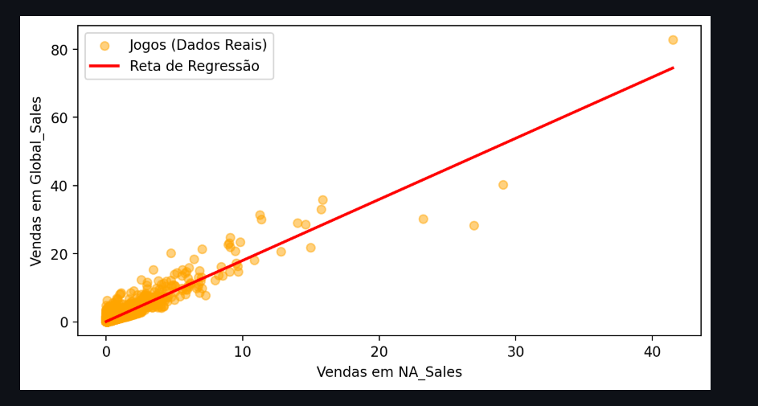

 📄 Relatório de Descobertas — Laboratório Estatístico

**Nome:** Pedro Felipe
**Curso:** Ciência da Computação

## 1. Dataset Escolhido e Justificativa
**Dataset:** Video Game Sales (Vendas de Jogos de Videogame).
**Justificativa:** O conjunto de dados foi escolhido por atender plenamente aos requisitos da sistematização (mais de 16.000 registros, variáveis numéricas de vendas regionais/globais e categóricas como plataforma e gênero). Além disso, a análise do mercado de jogos torna a aplicação prática dos conceitos estatísticos muito mais instigante para o escopo do curso de Ciência da Computação, permitindo explorar se o sucesso de um jogo em uma região dita o seu sucesso global.

---

## 2. Decisões de Implementação do Núcleo Estatístico
O núcleo estatístico (`minhastats.py`) foi desenvolvido do zero para evitar dependências de bibliotecas de alto nível no cálculo das métricas. Abaixo estão as principais fórmulas matemáticas (em notação padrão) que foram traduzidas para o código Python:

*   **Média Aritmética:** 
    $\bar{x} = \frac{1}{n} \sum_{i=1}^{n} x_i$
*   **Variância Amostral:** 
    $s^2 = \frac{1}{n-1} \sum_{i=1}^{n} (x_i - \bar{x})^2$
*   **Desvio Padrão Amostral:** 
    $s = \sqrt{s^2}$
*   **Covariância Amostral:** 
    $cov(X,Y) = \frac{1}{n-1} \sum_{i=1}^{n} (x_i - \bar{x})(y_i - \bar{y})$
*   **Coeficiente de Correlação de Pearson:** 
    $r = \frac{cov(X,Y)}{s_x s_y}$
*   **Regressão Linear Simples (Mínimos Quadrados):**
    *   Coeficiente angular (inclinação): $b_1 = \frac{cov(X,Y)}{s^2_x}$
    *   Intercepto: $b_0 = \bar{y} - b_1\bar{x}$

**Validação (Testes):** Todas as funções foram validadas utilizando o *framework* `pytest`. Os resultados gerados pelas funções próprias foram comparados contra as funções nativas das bibliotecas `numpy` e `scipy` (ex: `np.var`, `np.corrcoef`). Foi utilizada a tolerância numérica da função `math.isclose()` do Python, e o núcleo próprio obteve 100% de aprovação nos testes automatizados.

---

## 3. Explicação dos Módulos e Prints da Aplicação
### Módulo 2: Estatística Descritiva
A interface permite ao usuário selecionar uma região de vendas. A aplicação calcula todas as medidas de tendência central e dispersão e plota o histograma, permitindo visualizar o formato da distribuição.

### Módulos 3 e 4: Probabilidade e Simulação
Ao definir o tamanho e a quantidade das amostras, o laboratório aplica uma simulação de Monte Carlo. É possível observar o Teorema Central do Limite em ação: independentemente do formato original dos dados, a distribuição das médias amostrais se aproxima de uma curva Normal à medida que as amostras crescem.

### Módulo 5: Correlação e Regressão Linear
O usuário seleciona duas variáveis (ex: Vendas na América do Norte vs. Vendas Globais). O sistema gera o diagrama de dispersão, traça a reta de regressão calculada e fornece a equação da reta para prever vendas futuras, além de exibir o R².

---

## 💡 4. Módulo 6: As 3 Grandes Descobertas Estatísticas

1.  **A Assimetria do Sucesso (Outliers):** A análise descritiva demonstrou que a distribuição de vendas de jogos é fortemente assimétrica à direita. A média global é drasticamente elevada por pouquíssimos jogos de sucesso estrondoso (outliers, como os fenômenos da Nintendo), enquanto a grande maioria dos jogos vende muito abaixo da média, tornando a **mediana** uma medida muito mais realista para avaliar o desempenho comum de um título.
2.  **A Força do Teorema Central do Limite:** O dataset original não segue uma distribuição Normal. No entanto, ao executarmos a simulação sorteando médias repetidas, comprovamos visualmente e numericamente o TCL. A curva gerada acompanhou perfeitamente a Distribuição Teórica sobreposta, mostrando que a matemática funciona perfeitamente na consolidação de grandes amostras aleatórias.
3.  **A Influência do Mercado Norte-Americano (Regressão):** Ao cruzarmos `NA_Sales` (X) com `Global_Sales` (Y), encontramos um Coeficiente de Correlação de Pearson fortíssimo e um R² elevado. A reta de regressão linear mostrou que o sucesso comercial na América do Norte é um excelente preditor (tem forte tendência) para o sucesso global do título. Porém, respeitando o princípio estatístico, concluímos que essa forte correlação não implica exclusividade causal, já que o marketing global ocorre simultaneamente em múltiplas regiões.